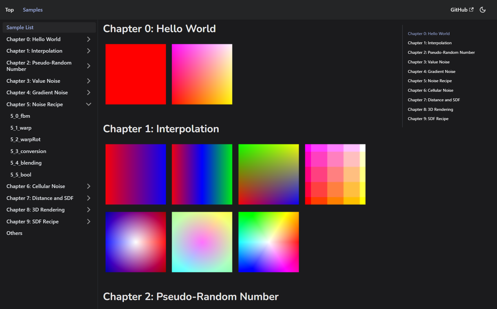

# Samples for "Math of Real-time Graphics"📚
Version 0.7.0   

# Description
You can view **UNOFFICIAL** samples for the book📚 ["Mathmatics of Real-Time Graphics" | "リアルタイムグラフィックスの数学"](https://gihyo.jp/book/2022/978-4-297-13034-3) written by Tatsuki HAYAMA and published by Gijutsu-Hyohron Co., Ltd.

# Pages
[Samples for "Math of Real-time Graphics"📚](https://tetunori.github.io/MathOfRealTimeGraphics-samples/)  
Errata and answers to exercises are original and not guaranteed.

# Environment💻
## Supported devices
This site can be viewed from PCs/Smartphones/tablets.
Also, A lot of latest OS/browser support `WebGL 2.0` now. Please check [can I use site](https://caniuse.com/webgl2).  
But please update your device beforehand.

# License⚖️
Copyright (c) 2022 [Tetsunori Nakayama](https://github.com/tetunori). MIT License.

# Reference📖
## Shader codes
All shader codes are from [official samples](https://gihyo.jp/book/2022/978-4-297-13034-3/support).

## Emoji icons
[fluentui-emoji](https://github.com/microsoft/fluentui-emoji) by [Microsoft](https://github.com/microsoft). MIT License.

## GLSL library
[glsl-canvas](https://github.com/actarian/glsl-canvas) by [actarian](https://github.com/actarian). MIT License.

## Static site generator
[docusaurus](https://github.com/facebook/docusaurus) by [Meta](https://github.com/facebook). MIT License.

## GLSL canvas box
Forked from [FlatifyCSS](https://flatifycss.com/) by [amir2mi](https://github.com/amir2mi). MIT License.
