# Sample List
## Chapter 0: Hello World
 
[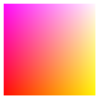](./chapter0/0_1_helloWorld.md) 

## Chapter 1: Interpolation
 
[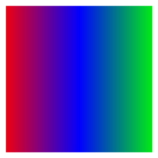](./chapter1/1_1_lerpTriple.md) 
 
[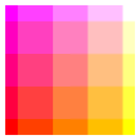](./chapter1/1_3_posterization.md) 
 
[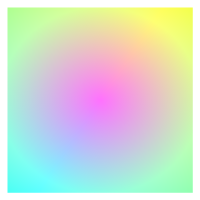](./chapter1/1_5_polarRot.md) 
 

## Chapter 2: Pseudo-Random Number
 
 
[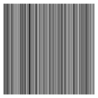](./chapter2/2_2_hash1d.md) 
 

## Chapter 3: Value Noise
 
 

## Chapter 4: Gradient Noise
 
 
 
 
 

## Chapter 5: Noise Recipe
 
 
 
 
 
[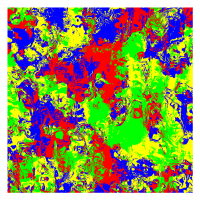](./chapter5/5_5_bool.md) 

## Chapter 6: Cellular Noise
 
 
 
 
 
 
 

## Chapter 7: Distance and SDF
[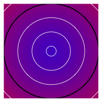](./chapter7/7_0_circle.md) 
[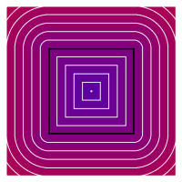](./chapter7/7_1_rectSDF.md) 
 
 
[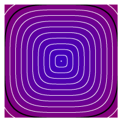](./chapter7/7_4_lp.md) 
 

## Chapter 8: 3D Rendering
 
 
 
 
[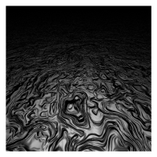](./chapter8/8_4_normalMapping.md) 
[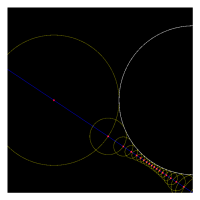](./chapter8/8_5_raymarching.md) 
 
 
 

## Chapter 9: SDF Recipe
 
[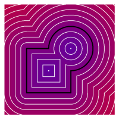](./chapter9/9_1_boolOp2d.md) 
 
 
 
[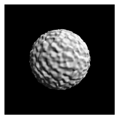](./chapter9/9_5_displacement.md) 
 
 
 

 
