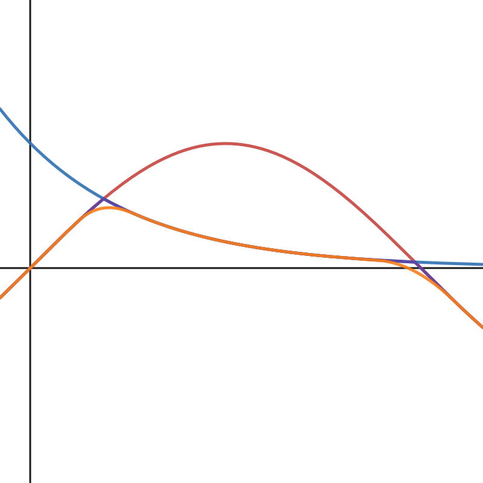
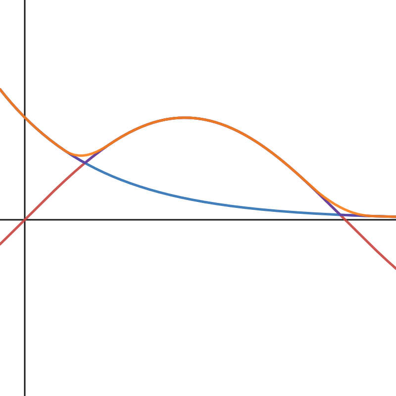
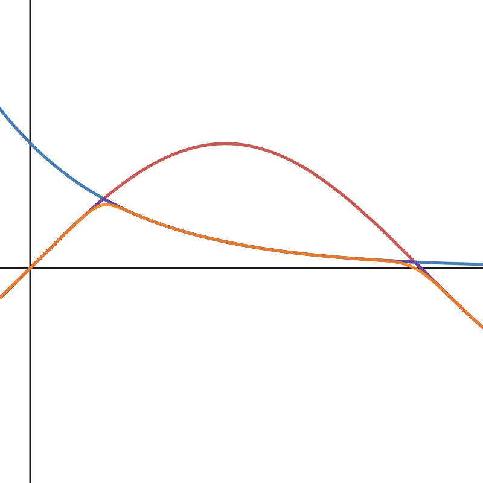

# Exercise 9.2
## Introduction
まずは、Codeをおさらいしておく。
```glsl
// Original smin
float smin(float a, float b, float k){
  float h = clamp(0.5 - 0.5 * (b - a) / k, 0.0, 1.0);
  return mix(a, b, h) - k * h * (1.0 - h); 
}

// Exercise functions below
float smax(float a, float b, float k){
  float h = clamp(0.5 + 0.5 * (b - a) / k, 0.0, 1.0);
  return mix(a, b, h) + k * h * (1.0 - h); 
}

float smin2(float a, float b, float k){
  float h = max( k - abs(a - b), 0.0 )/k;
  return min(a, b) - h * h * k * (1.0 / 4.0); 
}

float sminCubic(float a, float b, float k){
  float h = max( k - abs(a - b), 0.0 )/k;
  return min(a, b) - h * h * h * k * (1.0 / 6.0); 
}
```
これらの関数について、グラフの描画と微分可能性の証明を行う

## Graphs
### Original smin() for reference
[Graph in Desmos](https://www.desmos.com/calculator/pa6zkxseb5)  
[ ](https://www.desmos.com/calculator/pa6zkxseb5)

### smax()
[Graph in Desmos](https://www.desmos.com/calculator/qxh4ofwed1)  
[](https://www.desmos.com/calculator/qxh4ofwed1)  

### smin2()
[Graph in Desmos](https://www.desmos.com/calculator/p5fo41v1qt)  
[](https://www.desmos.com/calculator/p5fo41v1qt)

### sminCubic()
[Graph in Desmos](https://www.desmos.com/calculator/ublwtwwxfu)  
[](https://www.desmos.com/calculator/ublwtwwxfu) 

## Proofs
### smax()
#### 準備
smax関数の定義を確認すると、P.129-130で議論された $h(x),f(x),g(x)$ として
$$
\begin{aligned}
h(x) &= \text{clamp}(0.5 + \frac{b(x) - a(x)}{2k}, 0, 1) \\
f(x) &= \text{mix}(a(x), b(x), h(x)) \\
g(x) &= f(x) + kh(x)(1 - h(x))
\end{aligned}
$$
のように取ったものと言えるので、smaxについても[sminの場合の証明であるEx9.1](./exercise_9_1.md)の時と同様に $g(x)$ の微分可能性として確認できる。具体的には、やはり同様に正の定数 $k$ を設定したとして、 $|b(x) - a(x)| = k$ となるグラフの継ぎ目以外では微分可能性は自明なので、この継ぎ目付近の微分可能性のみを確認する。
なお、継ぎ目については $x_0$ は $b(x_0) - a(x_0) = k \text{ i.e } h(x_0) = 1$ を、$x_1$ は $a(x_1) - b(x_1) = k \text{ i.e } h(x_1) = 0$ を満たすものとしてそれぞれとることにする。

まずは $x = x_0, x_1$ での $h(x)$ の各微分係数をテキスト同様に計算すると、
$$
\tag{ex9.2.1} 
\begin{aligned}
\lim_{x \to x_0-0}h'(x) &= 0 \\
\lim_{x \to x_0+0}h'(x) &= \frac{b'(x_0) - a'(x_0)}{2k} \\
h(x_0) &= 1 \\
\lim_{x \to x_1-0}h'(x) &= \frac{b'(x_1) - a'(x_1)}{2k} \\
\lim_{x \to x_1+0}h'(x) &= 0 \\
h(x_1) &= 0
\end{aligned}
$$
らを得る。

また、この結果と $f(x)$ の定義、およびテキストP.130に記載された $f'(x)$ 
$$
f'(x) = a'(x) + h(x)(b'(x) - a'(x)) + h'(x)(b(x)-a(x))
$$
を使うと、
$$
\tag{ex9.2.2} 
\begin{aligned}
\lim_{x \to x_0-0}f'(x) &= b'(x_0) \\
\lim_{x \to x_0+0}f'(x) &= b'(x_0) + \frac{b'(x_0) - a'(x_0)}{2} \\
\lim_{x \to x_1-0}f'(x) &= a'(x_1) - \frac{b'(x_1) - a'(x_1)}{2} \\
\lim_{x \to x_1+0}f'(x) &= a'(x_1)
\end{aligned}
$$
らを得ることができる。

#### $x=x_0$ での微分可能性
さて、以後の計算のため、 $g(x)$ の導関数を計算すると
$$
\begin{aligned}
g'(x) &= f'(x) + kh'(x)(1-h(x)) + k h(x)(-h'(x)) \\
&= f'(x) + kh'(x) - \underline{kh'(x)h(x)} - \underline{kh(x)h'(x)} \\
&= f'(x) + kh'(x) - 2kh'(x)h(x)
\end{aligned}
$$
を得る。 $h(x) \xrightarrow{x \to x_0} 1$ なので、 $x_0$ での微分係数を求める際は $f'(x) - kh'(x)$ のみを計算すれば良い。

さて、(ex9.2.2)式より $\lim_{x \to x_0-0}f'(x) = b'(x_0)$ であり、さらに(ex9.2.1)式より $h(x)$ の左微分係数が $0$ であることから、 $g(x)$ の左微分係数は以下の様に容易に導かれる。 
$$
\lim_{x \to x_0-0}g'(x) = \lim_{x \to x_0-0}f'(x) - \lim_{x \to x_0-0}kh'(x)
= b'(x_0) - 0 = b'(x_0)
$$

次に、(ex9.2.2)式より、$\lim_{x \to x_0+0}f'(x) = b'(x_0) + \frac{b'(x_0) - a'(x_0)}{2}$ であり、さらに(ex9.2.1)式より $h(x)$ の右微分係数が $\frac{b'(x_0) - a'(x_0)}{2k}$ であることから、 $g(x)$ の右微分係数も以下の様に求められる。
$$
\begin{aligned}
\lim_{x \to x_0+0}g'(x) &= \lim_{x \to x_0+0}f'(x) - \lim_{x \to x_0+0}kh'(x) \\
&= b'(x_0) + \frac{b'(x_0) - a'(x_0)}{2} - k\frac{b'(x_0) - a'(x_0)}{2k} \\
&= b'(x_0) + \frac{b'(x_0) - a'(x_0)}{2} - \frac{b'(x_0) - a'(x_0)}{2} \\
&= b'(x_0)
\end{aligned}
$$
上記より $x = x_0$ で、左微分係数と右微分係数が等しいので、微分可能であることがわかった。

#### $x=x_1$ での微分可能性
$x=x_0$の時と同様に、
$$
g'(x) = f'(x) + kh'(x) - 2kh'(x)h(x)
$$
であり、$h(x) \xrightarrow{x \to x_1} 0$ なので、 $x_1$ での微分係数を求める際は $f'(x) + kh'(x)$ のみを計算すれば良い。

さて、(ex9.2.2)式より、 $\lim_{x \to x_1-0}f'(x) = a'(x_1) - \frac{b'(x_1) - a'(x_1)}{2}$ であり、さらに(ex9.2.1)式より、 $h(x)$ の左微分係数が $\frac{b'(x_1) - a'(x_1)}{2k}$ であることから、 $g(x)$ の左微分係数は以下の様に計算できる。 
$$
\begin{aligned}
\lim_{x \to x_1-0}g'(x) &= \lim_{x \to x_1-0}f'(x) + \lim_{x \to x_1-0}kh'(x) \\
&= a'(x_1) - \frac{b'(x_1) - a'(x_1)}{2} + k\frac{b'(x_1) - a'(x_1)}{2k} \\
&= a'(x_1)
\end{aligned}
$$

次に、(ex9.2.2)式より、$\lim_{x \to x_1+0}f'(x) = a'(x_1)$ であり、さらに(ex9.2.1)式より、$h(x)$ の右微分係数が $0$ であるので、これらの事実より $g(x)$ の右微分係数も以下の様に求められる。
$$
\begin{aligned}
\lim_{x \to x_1+0}g'(x) &= \lim_{x \to x_1+0}f'(x) + \lim_{x \to x_1+0}kh'(x) \\
&= a'(x_1)
\end{aligned}
$$
上記より $x = x_1$ で、左微分係数と右微分係数が等しいので、微分可能であることがわかった。

### smin2()
smin2関数を数学的な表現で書き直すと
$$
h(x) = \left\{
\begin{array}{ll}
0  & k \leq |a(x) - b(x)| \\
1 - |a(x) - b(x)|/k  & k > |a(x) - b(x)| 
\end{array}
\right.
$$
$$
f(x) = \left\{
\begin{array}{ll}
a(x) - h(x)h(x)k/4 & a(x) \leq b(x) \\
b(x) - h(x)h(x)k/4 & a(x) > b(x)
\end{array}
\right.
$$
となる。 $a(x), b(x)$ は微分可能な関数であるので、 $f(x)$ の微分可能性を確認するにあたり、上記条件分岐点の微分可能性を調べれば十分である。
今回、自明ではない分岐点の $x$ の値として、 $k = |a(x_0) - b(x_0)|$ を満たす $x_0$ ( $h(x)$ の分岐点)と、$a(x_1) = b(x_1)$ を満たす $x_1$ ( $f(x)$ の分岐点) の2つを取る。

また、以後の計算のために、 $f(x)$ の微分 $f'(x)$ を計算しておく。その定義より
$$
f'(x) = \left\{
\begin{array}{ll}
a'(x) - 2h'(x)h(x)k/4 = a'(x) - h'(x)h(x)k/2 & a(x) \leq b(x) \\
b'(x) - 2h'(x)h(x)k/4 = b'(x) - h'(x)h(x)k/2 & a(x) > b(x)
\end{array}
\right.
$$

#### $x=x_0$ での微分可能性
$f(x)$ の $x=x_0$ での左微分係数について、$h(x) \xrightarrow{x \to x_0-0} 0$に注意して計算すると、
$$
\lim_{x \to x_0-0}f'(x) = \text{min}(a'(x_0),b'(x_0)) - \lim_{x \to x_0-0}h'(x)h(x)k/2 =  \text{min}(a'(x_0),b'(x_0)) 
$$ 
であることがわかる。次に、右微分係数についても、やはり、$h(x) \xrightarrow{x \to x_0+0} 0$ であるので、同じく
$$
\lim_{x \to x_0+0}f'(x) =  \text{min}(a'(x_0),b'(x_0)) - \lim_{x \to x_0+0}h'(x)h(x)k/2 =  \text{min}(a'(x_0),b'(x_0)) 
$$ 
となり、左右の微分係数が等しくなるので、 $x=x_0$ での微分可能性は確認できた。

#### $x=x_1$ での微分可能性
まずは、 $h(x)$ の $x=x_1$ 点での微分係数を求めておきたい。なお、ここでは、 $x_1$ の左側で $a(x)>b(x)$ 、 $x_1$ の右側で $a(x)<b(x)$ となると仮定する。すると、下記の様に左右の微分係数を得る。
$$
\begin{aligned}
\lim_{x \to x_1-0}h'(x) &= - a'(x)/k + b'(x)/k \\
\lim_{x \to x_1+0}h'(x) &= a'(x)/k - b'(x)/k
\end{aligned}
$$ 

$f(x)$ の $x=x_1$ 左微分係数については、 $a(x_1) - b(x_1) = 0$ が $h(x) \xrightarrow{x \to x_1} 1$ を導くことに注意して計算する。
上記前提のもと、左微分係数は、
$$
\begin{aligned}
\lim_{x \to x_1-0}f'(x) &= b'(x_1) - \lim_{x \to x_1-0}h'(x)h(x)k/2 \\
&= b'(x_1) - \lim_{x \to x_1-0}h'(x)k/2 \\
&= b'(x_1) - (- a'(x_1)/k + b'(x_1)/k)k/2 \\
&= b'(x_1) + (a'(x_1) - b'(x_1))/2 \\
&= (a'(x_1) + b'(x_1))/2
\end{aligned}
$$ 
となり、また、右微分係数も
$$
\begin{aligned}
\lim_{x \to x_1+0}f'(x) &= a'(x_1) - \lim_{x \to x_1+0}h'(x)h(x)k/2 \\
&= a'(x_1) - \lim_{x \to x_1+0}h'(x)k/2 \\
&= a'(x_1) - (a'(x_1)/k - b'(x_1)/k)k/2 \\
&= a'(x_1) + (-a'(x_1) + b'(x_1))/2 \\
&= (a'(x_1) + b'(x_1))/2
\end{aligned}
$$ 
となる。

上記より $x = x_1$ で、左微分係数と右微分係数が等しいので、微分可能であることがわかった。

以上より、全ての点で微分可能であることが確かめられた。

### sminCubic()
sminCubicについては、h(x)が共通なので、smin2と同様に証明が可能である。
f(x)は
$$
f(x) = \left\{
\begin{array}{ll}
a(x) - h(x)h(x)h(x)k/6 & a(x) \leq b(x) \\
b(x) - h(x)h(x)h(x)k/6 & a(x) > b(x)
\end{array}
\right.
$$
となり、その微分 $f'(x)$ が
$$
f'(x) = \left\{
\begin{array}{ll}
a'(x) - 3h'(x)h(x)h(x)k/6 = a'(x) - h'(x)h(x)h(x)k/2 & a(x) \leq b(x) \\
b'(x) - 3h'(x)h(x)h(x)k/6 = b'(x) - h'(x)h(x)h(x)k/2 & a(x) > b(x)
\end{array}
\right.
$$
となるので、smin2時に証明した $x=x_0$, $x=x_1$ での微分可能性の確認方法がそのまま適用できる。
